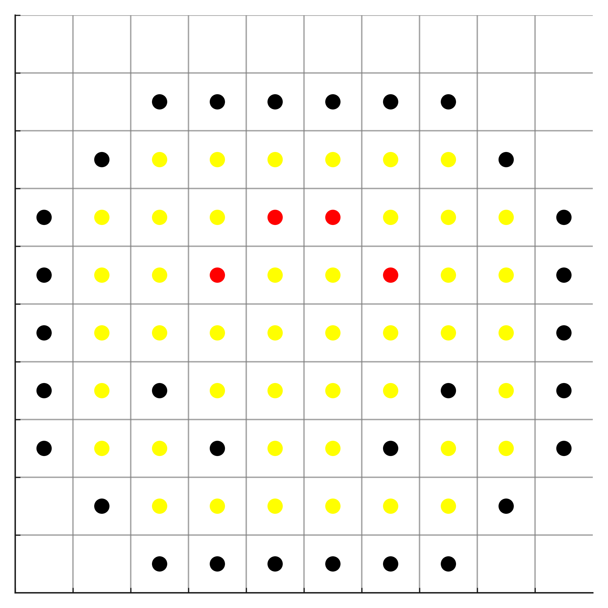

# 🎨 PixelArt à colorier

Une application web simple et ludique pour transformer vos images en pixel art à colorier — idéale pour les enfants, les parents, les profs ou les fans de DIY !




---

## 🚀 Fonctionnalités

- 🖼️ Upload de n'importe quelle image (JPEG/PNG)
- 📏 Réglage de la taille de la grille (ex : 10x10 à 50x50)
- 🎯 Ajustement de la taille des points
- 💾 Aperçu instantané et téléchargement du résultat

---

## ▶️ Lancer l'application en local

```bash
# 1. Cloner le dépôt
git clone https://github.com/sylvainPgt/pixelart-coloriage.git
cd pixelart-coloriage

# 2. Créer un environnement virtuel
python -m venv venv
.\venv\Scripts\activate

# 3. Installer les dépendances
pip install -r requirements.txt

# 4. Lancer l'app
streamlit run app.py

## 📦 Dépendances

- [streamlit](https://streamlit.io/)
- [matplotlib](https://matplotlib.org/)
- [numpy](https://numpy.org/)
- [Pillow (PIL)](https://python-pillow.org/)

---

## 🌐 Déploiement (à venir)

- [ ] Démo publique via Hugging Face Spaces ou Streamlit Cloud
- [ ] Packs de modèles pixel art préfaits
- [ ] Export PDF haute résolution
- [ ] Version mobile ou app tablette ?

---

## 🤝 Contribuer

Les idées, suggestions ou pull requests sont les bienvenus !  
Tu peux aussi ouvrir une issue pour proposer une nouvelle fonctionnalité.

---

## 📄 Licence

MIT — Libre de l'utiliser, le modifier, le partager 🙌
